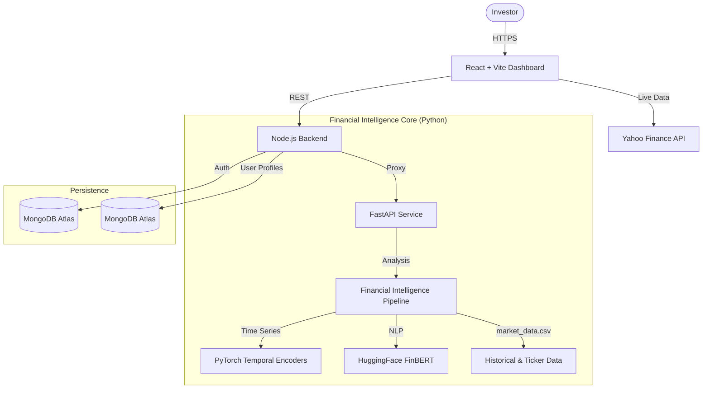
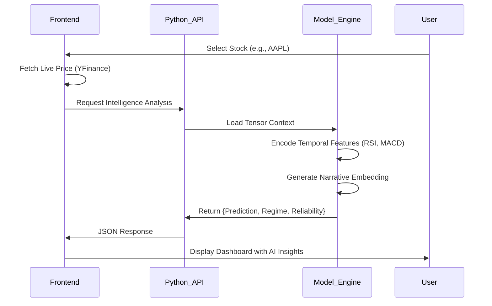

# 🦅 Aletheia AI - Intelligent Market Intelligence Platform
> **Team:** Heisenbug Collective

**Unveiling Truth in Financial Noise.**

Aletheia AI is a next-generation financial intelligence platform that fuses **Real-Time Market Data**, **Deep Learning (PyTorch)**, and **Causal Reasoning** to provide investors with actionable insights. Beyond simple price tracking, Aletheia helps users understand the *narrative* behind the numbers.

**Stack:** React 19, Node.js, Python (FastAPI/PyTorch/Transformers), Yahoo Finance API, JWT Authentication, MongoDB Atlas.

---

## 🌟 Project Overview

### 🚩 Problem Statement
Retail and institutional investors alike are drowning in data but starving for insight. 
*   **Information Overload**: Live tickers, news feeds, and social sentiment create a noise-to-signal ratio that is impossible for humans to process in real-time.
*   **Reactive Decision Making**: Most tools tell you what *happened*, not what is *likely* to happen or *why* it's happening.
*   **Lack of Context**: Knowing a stock is down 5% is useless without knowing if it's a market-wide correction or a company-specific crisis.

### 🎯 Our Solution
**Aletheia AI** acts as an intelligent co-pilot for financial decision-making.

1.  **AI-Powered Narrative Summaries**: Uses **FinBERT** (Financial BERT) to analyze textual data and generate concise, human-readable explanations for market movements.
2.  **Market Regime Detection**: Automatically classifies the current market state (e.g., *Stable Growth*, *Volatile*, *Crisis*) using deep temporal analysis.
3.  **Reliability Scoring**: Every prediction comes with a confidence score, preventing blind trust in black-box models.
4.  **Live Ecosystem**: Seamlessly blends real-time data from **Yahoo Finance** with our proprietary AI analysis models.

---

## 🏗️ System Architecture

### 🏛️ High-Level Architecture


### 🧠 The Intelligence Pipeline
How we turn raw tickers into wisdom.



---

## ✨ Core Features Explained

### 🚀 Financial Intelligence Pipeline (FIP)
*The brain of Aletheia.*

The FIP is a multi-modal analysis engine that processes both numerical and textual data to form a holistic view of an asset.
1.  **Temporal Encoding (Time-Series)**: 
    *   We use a custom **PyTorch** model that ingests a rolling window (default: 30 days) of market data.
    *   Features include OHLCV (Open, High, Low, Close, Volume) and derived technical indicators like **RSI, MACD, and Bollinger Bands**.
    *   These features are passed through an LSTM/GRU-based encoder to capture long-term dependencies and trend momentum.
2.  **Tabular Integration**: 
    *   Static or slowly changing data (Fundamental ratios, Sector classification) is fed into a separate dense network.
    *   This "context vector" is concatenated with the temporal embeddings to provide a baseline for the asset's intrinsic value.
3.  **Narrative Context (NLP)**:
    *   When news is available, we use **FinBERT**, a BERT model fine-tuned on financial sentiment.
    *   It generates a 768-dimensional embedding of the latest market news, which is fused with the numerical data.
    *   *Result:* The model knows *that* the price dropped, and the news tells it *why* (e.g., "CEO Scandal" vs "Market Correction").

### 🛡️ Regime Detection & Anomaly Handling
*Knowing the weather before you sail.*

Markets behave differently in different states. A strategy that works in a bull market often fails in a crash.
*   **Regime Classification**: 
    *   The system classifies the current market environment into discrete states:
        *   **Stable Growth**: Low volatility, consistent upward trend.
        *   **Volatile**: High variance, choppy price action.
        *   **Crisis**: Extreme downside momentum (Panic selling).
*   **Self-Healing & Anomaly Detection**:
    *   If the input data is corrupted (e.g., missing values, impossible prices from API), the system enters "Calibration Mode".
    *   It prevents erroneous predictions by falling back to safe defaults and alerting the user, rather than outputting garbage warnings.

### 📊 Interactive Investor Dashboard
*Premium Design. Instant Clarity.*

The frontend is built to withstand the demands of active monitoring.
*   **Drag-and-Drop Watchlist**: 
    *   A two-column layout where users can drag specific stocks into an "Deep Analysis" zone to trigger the ML pipeline.
*   **Live Yahoo Finance Data**: 
    *   Prices, percentage changes, and volume data are streamed in real-time.
    *   We bridge the gap between "Live Data" (YFinance) and "Intelligence" (Our Python Backend) seamlessly.
*   **Rich Visualizations**: 
    *   **Interactive Price Charts**: Zoomable, pannable history charts using **Recharts**.
    *   **Trend overlays**: Visual indicators of the AI's predicted direction over the actual historical data.

### 🤖 Aletheia Chat Assistant
*Your 24/7 Analyst.*

*   **Context-Aware**: The chatbot isn't just a generic LLM. It has access to the *context* of your current view. 
*   **Integrated**: Accessible directly from the navbar, allowing you to ask questions like *"What does the Regime 'Volatile' imply for my portfolio?"* without leaving the dashboard.

---

## 🛠️ Technology Stack

### 🧠 AI & Data Science
*   **Python 3.10+**: Core language for intelligence services.
*   **FastAPI**: High-performance async API for model serving.
*   **PyTorch**: Deep learning framework for the FIP model.
*   **Transformers (HuggingFace)**: FinBERT for NLP tasks.
*   **Pandas/NumPy**: Data manipulation and tensor preparation.
*   **Yahoo Finance (yfinance)**: Live user-facing market data.

### 💻 Frontend
*   **React 19**: Latest React features for a responsive UI.
*   **Vite**: Blazing fast build tool.
*   **TailwindCSS**: Utility-first styling with custom glassmorphism effects.
*   **Lucide React**: Beautiful, consistent iconography.
*   **Recharts**: Composable charting library.

### ⚙️ Backend & Infrastructure
*   **Node.js & Express**: Backend API gateway.
*   **JWT & Google OAuth**: Secure, custom authentication with httpOnly cookie sessions and Google Sign-In support.
*   **MongoDB Atlas**: scalable NoSQL database for user data.
*   **Docker**: Full-stack containerization for consistent deployment.

---

## 🚀 Quick Start

### Prerequisites
*   Node.js v18+
*   Python 3.10+
*   Docker & Docker Compose (Recommended)

### Installation

1.  **Clone the Repository**
    ```bash
    git clone https://github.com/heisenbug-collective/aletheia-ai.git
    cd turing_pg_project
    ```

2.  **Environment Variables**
    Create a `.env` file in the root directory:
    ```env
    # Python Service
    PYTHON_ENV=development
    
    # Node Service
    MONGO_URI=mongodb+srv://...
    ACCESS_TOKEN_SECRET=...
    REFRESH_TOKEN_SECRET=...
    GOOGLE_CLIENT_ID=...
    
    # Frontend
    VITE_GOOGLE_CLIENT_ID=...
    ```

3.  **Run with Docker**
    ```bash
    docker-compose up --build
    ```
    Access the application at `http://localhost:3001`.

---

## 🤝 Team: Heisenbug Collective

| Name | Role |
| :--- | :--- |
| **Aryan Agarwal** | **Web Development**|
| **Swastik Gupta** | **Web Development** |
| **Saharsh Srivastava** | **Machine Learning & AI** |

---

Made with ❤️ by Heisenbug Collective.
